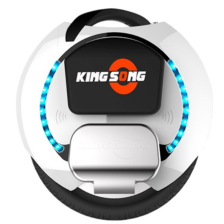
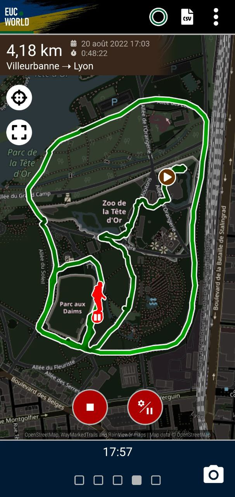
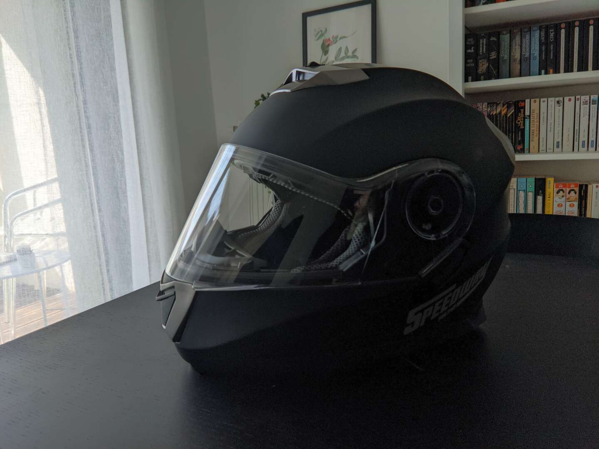
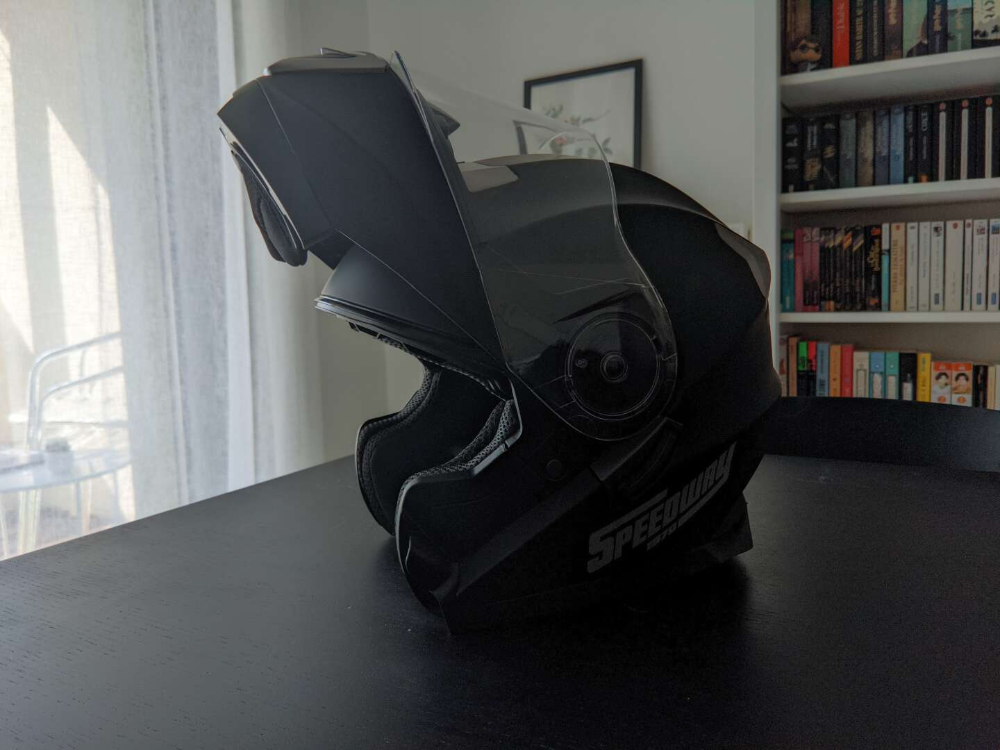

J'ai eu l'occasion de tester de nombreux moyens de transport alternatifs pour des déplacements quotidiens en ville *(Trottinettes, Vélo électrique)* mais aucun ne m'a jamais autant tenté que la **gyroroue** ! 
Depuis que j'ai découvert ce véhicule via les vidéos de *Thomas*(**[Mr.Flex sur YouTube](https://www.youtube.com/c/MonsieurFlex)**), je fantasme sur l'idée de pouvoir m'en servir pour mes déplacements en plus de pouvoir prendre le train, bus ou tram.

<video>
<source src="https://yewtu.be/embed/gig7h5cky4k" autoplay="false"></source>
</video>

Jusque-là, je me déplaçais exclusivement en *vélo électrique (avec environ ~10 km pour arriver au travail)*, seuls les deux-roues m'intéressaient.
Puis, pendant mes vacances d'étés de 2022, et étant donné que j'avais beaucoup de temps libre : je me suis dit "**Pourquoi pas ?**".
Je me suis donc procuré un appareil d'occasion nommé le **Kingsong ks-16b**. 
 

Utiliser un appareil d'occasion me rassure pas mal en sachant que je ne veux pas abîmer du *neuf*, je récupère cette roue avec un kilométrage de **265 km** et une batterie de **680Wh** *(me suffisant pour faire 40km)*.
J'ai essayé de faire au moins 20 minutes d'apprentissages par jour pour me familiariser avec la bête et espérer la maîtriser en moins d'une semaine. *(Ce que les gens promettent parfois sur les réseaux.)*

Je vais donc résumer dans la prochaine partie mes avancées dans l'apprentissage de la gyroroue. 

## La longue route

### Lundi 08/08
Première séance de *30min*. Je comprends à quel point on sous-estime le simple fait de monter sur la roue sans s'appuyer sur un mur. J'arrive à monter avec peine mais je suis surpris de pouvoir y arriver en si peu de temps. 
Je peux démarrer et faire 1-2m sans tomber. 
### Mardi 09/08
Je m'accroche pendant une belle heure, objectif : *aller d'un point A à un point B*. *(En l'occurrence : traverser mon garage)*
Je prends une ceinture *(à mettre dans le trolley, ça aide à ce que la roue ne tombe pas alors que je descends de la roue)* et je démarre pour faire une simple ligne droite. Aucun succès, pas moyen de faire quelques mètres sans devoir mettre pied à terre. 
Je ne désespère pas en réussissant à faire *le pendule* contre un mur mais je suis un peu déçu de ne pas pouvoir faire mieux. 
### Mercredi 10/08
Mercredi se décompose en 2 séances d'une heure chacune : matin, et après-midi. 
Le matin, aucune avancée. Des pendules, j'avance contre un mur à droite, j'avance *(un peu)* contre un mur à gauche mais insatisfait de ma progression. 
Je me motive à faire une nouvelle séance qui commence de la même manière. *(Je traverse un peu mon garage en long mais incapable de me tenir droit)*
Je suis conscient que je dois aller vite et projeter mon regard, mais comment faire des dizaines de mètres si je n'arrive pas à tenir droit sur 2-3m ? Et en décidant de prendre une grande ligne droite et d'appuyer sur le champignon : j'arrive à me stabiliser **pendant** les 2-3 premiers mètres avant de continuer sur ma lancée. 
La solution à comprendre : C'est normal que je sois déséquilibré au début, c'est justement *pour trouver ma stabilité* ! 
Je m'amuse à faire 20… 30 et 50 mètres, je n'arrive pas à rouler droit, mais j'avance, et c'est ce qui compte. 
### Jeudi 11/08
Plein de confiance, je reprends là où je me suis arrêté. Je file plus ou moins droit mais je n'ai aucune difficulté à avancer. 
Je m'arrête après 20min à cause d'une douleur du pied droit, en sachant que je suis encore très crispé : ça ne m'étonnerait pas que ça soit à cause de mon manque de confiance. 
J'arrive à faire un virage parfait *(pas saccadé)*, hâte de m'entraîner à faire de belles courbes.
### Samedi 13/08
J'arrive à tourner à 90° ! 
J'ai quelques douleurs musculaires, je prend quelques pauses entre chaque séance pour éviter de conserver ces douleurs. 
### Samedi 20/08
Après la bonne pause d'une semaine, je profite d'une sortie en famille pour faire de la gyroroue en parc. 
J'ai roulé ~30min pour une distance d'environ 4km (!). J'arrivais à esquiver les groupes de personnes sans soucis et à atteindre une vitesse de **23km/h**. 
Il me manque surement de la précision, mais je me sens vraiment en confiance. 

J'ai bien pensé à enregistrer le trajet via l'application **Euc World** mais aucun moyen de le partager via le site officiel. Voici une capture d'écran prise le jour-même. 

 ## Equipement

J'envisage de me servir de la roue au quotidien. Et tout comme le vélo, je souhaite m'imposer un certain équipement. 
Casque intégral *(moto, moto-cross ou VTT)* et protection au dos seront mon minimum. J'envisage aussi de mettre des genouillères et des protections aux coudes. 

### Casque
J'ai beaucoup réfléchi à un casque intégral qui pourrait être confortable, pratique et sécurisant. 
Ma première suggestion était un casque de VTT/BMX qui recouvrirait le menton *(pour protéger la machoire)* mais je me suis finalement orienté vers un casque moto classique. [Lien ici](https://www.amazon.fr/Casque-Speedway-modulaire-homologu%C3%A9-visi%C3%A8re-Blanc-Noir-Mat/dp/B07YZD2VXL/)

N'ayant jamais été sur la moindre moto, je trouve ce casque un peu lourd mais j'imagine que c'est un poids correct pour un réel casque intégral. (1.6kg)

## Assurance
Pour rouler sur route, je souhaite avoir une assurance pour protéger les gens et me protéger. Comme de nombreux Wheelers, ~~je pense me tourner vers Wizza~~

En contactant la MAIF (avec laquelle je possède un contrat), j'ai remarqué qu'ils avaient également une offre pour les EDPMs, et donc les gyroroues. 
Le prix est d'environ 5€/mois.
