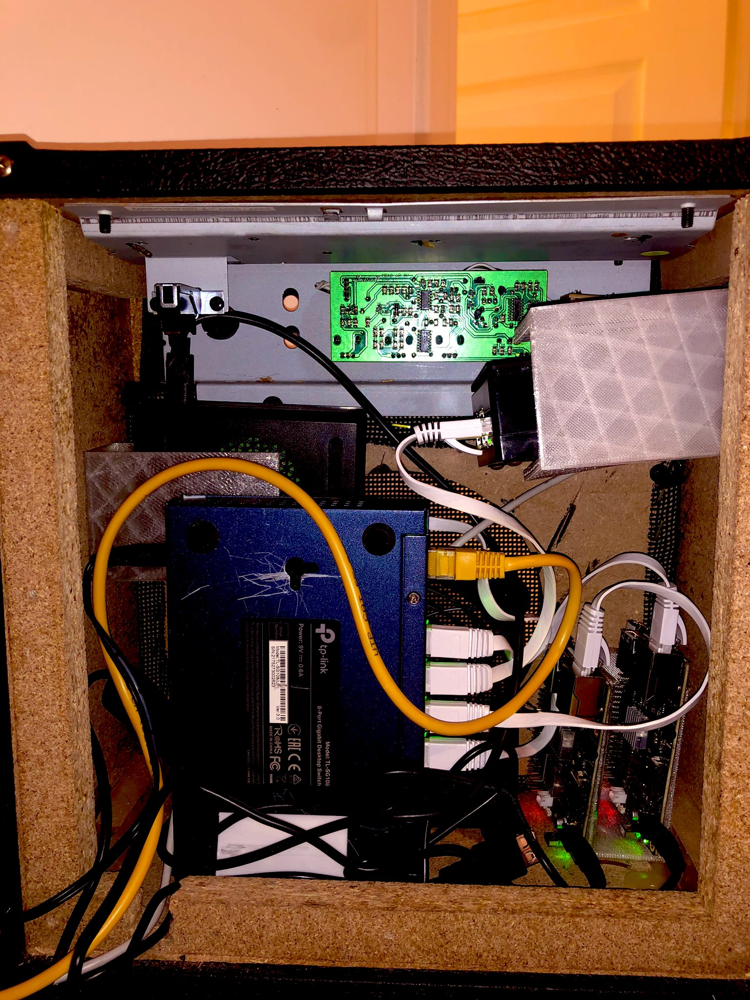
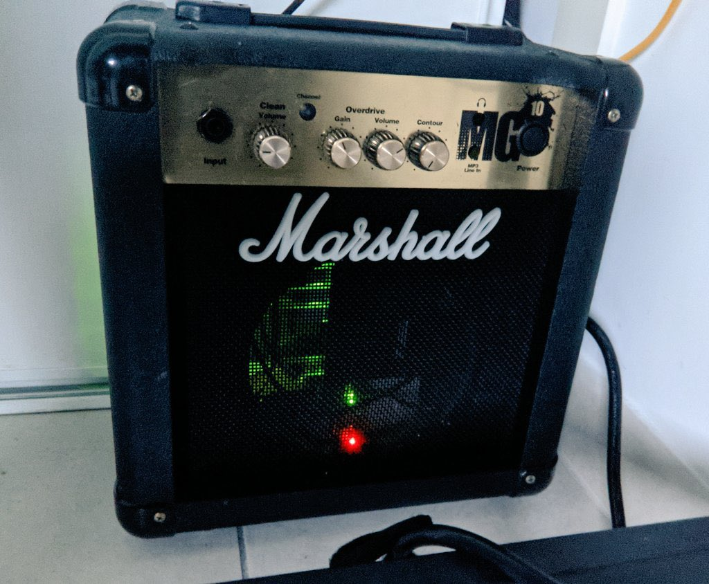
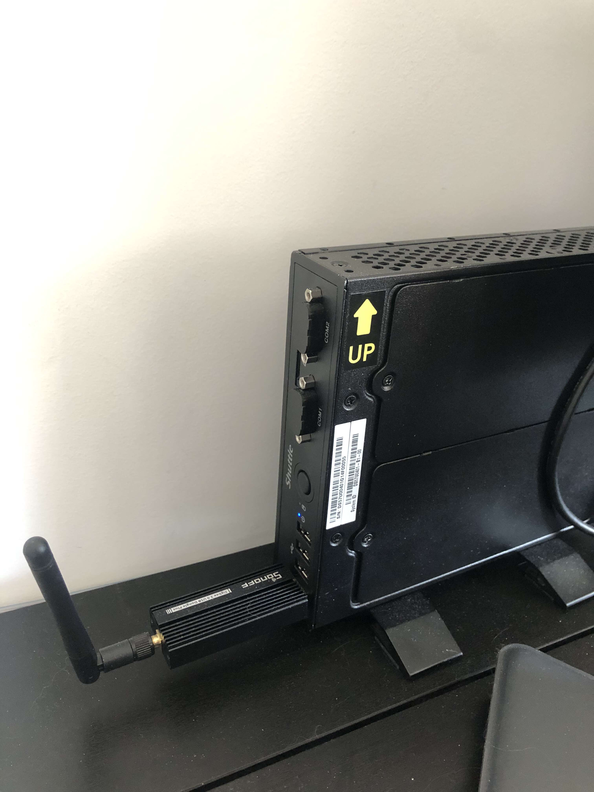

---
slug: Mon-Setup
title: Mon matériel
authors:
  name: TheBidouilleur
  title: Adorateur de trucs merdiques
  url: https://github.com/qjoly/
  image_url: https://avatars.githubusercontent.com/u/82603435?v=4
tags: [perso]
---

Le déploiement, la virtualisation, le maintien d’une infrastructure Homelab sont des pratiques qui demandent du temps et également de l’argent.
C’est pourquoi j’ai décidé de créer un petit billet que je peux ressortir pour expliquer le matériel que j’utilise.

Je vais donc partager les machines que j’utilise **chez moi** ou **en cloud**.

:::caution “Trop”, n’est pas “bien”

Je ne souhaite pas décourager les gens qui débutent dans ce domaine. 
Il n’est nullement nécéssaire d’avoir autant de matériel, je suis un passionné *(un chouia trop, je sais)* qui n’hésite pas à mettre les moyens.

Vous pouvez obtenir de meilleurs résultats avec moins.
:::

## Mon infrastructure à la maison

J’ai emménagé dans mon appartement en 2022 à Lyon après 7 mois à Toulouse. Dans ma tête, cet emménagement est une liberté. La liberté de pouvoir reprendre l’informatique *chez moi* et plus uniquement en cloud.

Par ordre chronologique.. J’ai d’abord utilisé un vieux portable *(Dont je n’ai plus la photo)* sur lequel j’ai installé un Proxmox pour commencer à m’installer un cluster k3s avec des machines virtuelles.

Puis… j’ai re-découvert un vieux joujou : ma **Raspberry Pi B+** !

J’ai donc eu l’idée de créer mon cluster k3s à la maison avec juste du matériel ARM. L’avantage premier est d’avoir une consommation basse et de travailler sur de vraies machines *(Plus fun que d’avoir des VMs)*

### Cluster ARM

Je me suis alors procuré *4 machines*, j’aurais aimé 4 Raspberry Pi 4, mais faute de moyens : je n’en ai obtenu que 2. Les deux autres machines sont des [Rock64](https://pine64.com/product/rock64-4gb-single-board-computer/), des équivalents de Raspberry Pi 3 avec plus de RAM.

 

J’ai récupéré un vieil ampli Marshall pour l’aspect *design*. *(Puis ça plait un peu à ma compagne, qui fait très attention à la déco de notre appartement)*
Je suis presque déçu de la quantité de câbles *(alimentation du Switch, 4 câbles pour alimenter les nœuds, 1 câble Ethernet pour le Switch)* mais je m’en contenterai pour le moment. à l’avenir, je bricolerai une alimentation pour me débarrasser de la multiprise et n’avoir qu’une unique prise.

Ce cluster héberge à la fois ce site ainsi que d’autres applications privées *(Bitwarden, FreshRSS, un MQTT)*. J’aimerais beaucoup ajouter un serveur mail, mais ça sera l’occasion après un changement de FAI puisque __Orange bloque le port 25 sur les connections domiciles__.

### Shuttle Proxmox

Mais même si mon attention se porte principalement sur le cluster, je voulais également avoir une machine pour héberger des applications plus *“classiques”* et sans conteneurs. J’ai donc acheté un mini-ordinateur Shuttle *(ds57u3)* sur lequel j’ai mis un SSD Samsung de 1To ainsi que 16Go de RAM.

Sur cette machine, j’ai des VMs avec **Home-Assistant**, mon VPN *(Wireguard)*, mon [netboot](/docs/AdminSys/netbootxyz/) et mon [DHCP](/docs/AdminSys/dnsmasq/). Je voulais absolument avoir un hyperviseur pour continuer à manipuler Terraform.

## Infrastructure Cloud
### Proxmox OVH
Mes principales applications sont sur un serveur dédié OVH que je loue. *(Pour ceux qui aiment les specs, j’ai un Xeon CPU E5-1620 de 8 cœurs avec 32Go de RAM)*
C’est un Proxmox *(aussi)* sur lequel j’ai mon serveur mail, un cluster de *4 noeuds* K3S, mon serveur multimédia et pleins d’autres trucs.

Cette infrastructure est ce que je considère comme de la *production* à l’échelle de mon Homelab. Il doit être accessible 24/7 !
J’héberge différentes applications qui me sont indispensables à moi et/ou mes proches. *(Par exemple, mes notes, le cloud de ma remarkable, mon kanboard)*

Je stocke aussi des sauvegardes de mon infra HomeLab.

### Oracle - FreeTier

Comme dernier serveur, j’utilise le cloud **FreeTier** avec une seule et unique machine avec 24Go de RAM. Sachant que je ne paye pas ce serveur, je considère qu’il peut être arrêté **à tout moment**.
Celui-ci m’est utile comme machine de test. *(Comme pour mon homelab, j’aurais voulu y héberger un serveur mail, mais le port 25 est également bloqué)*

En plus des différents tests que j’exécute sur cette machine, j’y ai installé un conteneur avec un Guacamole relié à un XFCE pour être libre lorsque je suis en déplacement.

## Conclusion ? 

Je pense sincèrement que je n’ai pas besoin de toutes ces machines. J’essaye tant bien que mal de me limiter et de faire le plus attention à ma consommation électrique ainsi qu’à mon empreinte carbone. Je n’ai pas non-plus parlé de mon NAS qui pourrait faire l’objet d’un billet entier à lui-seul.
