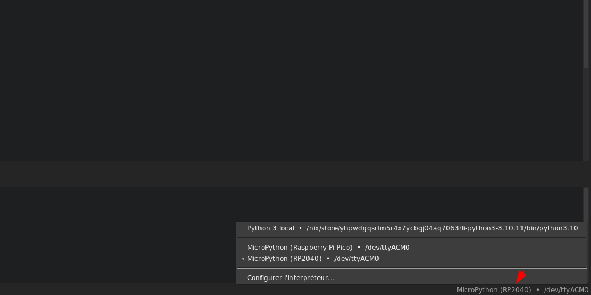
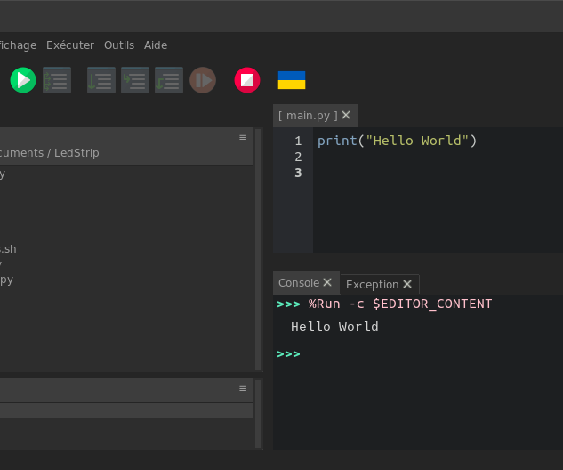
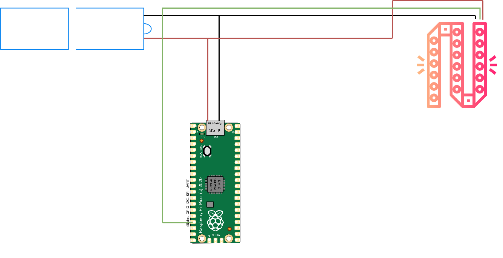

## Introduction

En suivant les derniers threads de [Denis Germain](https://blog.zwindler.fr/2023/06/16/revere-blinky-enix/) à propos du [Blinky](https://www.getblinky.io/) (Un gyrophare connecté composé d'un ESP32 et de LEDs RGB adressables), j'ai eu l'inspiration pour reprendre le développement sur carte.

J'ai beaucoup travaillé sur des cartes Arduino et ESP8266/ESP32, mais uniquement avec l'IDE Arduino. Avec l'arrivée de MicroPython et TinyGo, j'ai décidé de me lancer dans l'aventure.

## Installation de notre environnement de développement

### Installation de Thonny

Voici les différentes méthodes d'installation de Thonny en fonction de votre système d'exploitation.

```mdx-code-block
import Tabs from '@theme/Tabs';
import TabItem from '@theme/TabItem';

<Tabs>
  <TabItem value="Linux" label="Linux" default>
   Flatpak
     <code>flatpak install org.thonny.Thonny</code>
   Snap
     sudo snap install thonny
   Debian, <b>Raspbian</b>, <b>Ubuntu</b>, <b>Mint</b> and others
     sudo apt install thonny
   Fedora
     sudo dnf install thonny

  </TabItem>
  <TabItem value="Python" label="Python" default>

    pip3 install thonny

  </TabItem>
  <TabItem value="MacOS" label="MacOS">

    brew install thonny

  </TabItem>
</Tabs>
```

### Installation de MicroPython sur une carte RP2040/PICO

Récupérer le fichier UF2 sur le site de [MicroPython](https://micropython.org/download/rp2-pico/)

`wget https://micropython.org/download/rp2-pico/rp2-pico-latest.uf2`

Dès le fichier déposé sur la carte, celle-ci se redémarre et est prête à l'emploi.


Il suffira d'ouvrir Thonny et de sélectionner la carte RP2040/PICO disponible dans la liste des périphériques.



Et histoire de tester notre installation, nous allons taper quelques lignes de code dans la console REPL.

```python
print("Hello World")
Hello World
```

Et écrire notre premier "Hello-World" dans un fichier `main.py` qui sera exécuté au démarrage de la carte.



## Débuter le développement

### Hello-World

Carte connectée, environnement de développement installé, il est temps de commencer à développer. On va écrire 'Hello World' sur la console REPL et faire clignoter la LED verte de la carte.

```python
from machine import Pin
import time

led = Pin("LED", Pin.OUT)

while True:
    led.on()
    time.sleep(1)
    led.off()
    time.sleep(1)
```

### Se connecter à un réseau WiFi

C'est bien beau de faire clignoter une LED, mais si on veut faire des choses un peu plus intéressantes, il va ajouter un moyen de communiquer avec la carte. Pour cela, on va connecter la carte à un réseau WiFi.

```python
import time, network, urequests
from machine import Pin

ssid = 'MON_SSID'
password = "MA_PASSPHRASE"

def connect():
    wlan = network.WLAN(network.STA_IF)
    wlan.active(True)
    wlan.connect(ssid, password)
     
    max_wait = 10
    while max_wait > 0:
        if wlan.status() < 0 or wlan.status() >= 3:
            break
        max_wait -= 1
        print('waiting for connection...')
        time.sleep(1)
 
    # Handle connection error
    if wlan.status() != 3:
        raise RuntimeError('network connection failed')
    else:
        status = wlan.ifconfig()
        print( 'ip = ' + status[0] )
if __name__ == "__main__":
    connect()
    while True:
        time.sleep(1)
```


Victoire ! Notre carte est connectée à notre réseau WiFi. On va maintenant pouvoir faire des requêtes HTTP ou à l'inverse, recevoir des requêtes HTTP.

### Github_CI_Watchdog

Eh oui, il est temps de commencer un réel projet. Je souhaite développer un petit outil qui va me permettre de surveiller les builds de mes projets sur Github, sachant que mon blog utilise Docusaurus et que le temps de build est vraiment très long (plus de 10 minutes).

Dès qu'un article est terminé, je le pousse sur Github et je lance le build. Il arrive que mes fichiers Markdown ne soient pas corrects et que le build échoue. Je dois donc relancer le build et attendre à nouveau 10 minutes.

C'est pour cela que je souhaite avoir un signal visuel du statut de mon build pour le relancer si besoin.

Pour ce faire, j'ai développé un petit code qui va directement interroger l'API de Github et récupérer le statut du dernier build.

```python
import urequests as requests

def get_latest_workflow_status(owner, repo):
    url = f"https://api.github.com/repos/{owner}/{repo}/actions/workflows"
    headers = {"User-Agent": "qjoly"}
    response = requests.get(url, headers=headers)
    if response.status_code == 200:
        workflows = response.json()["workflows"]
        if workflows:
            latest_workflow = workflows[0]
            latest_workflow_id = latest_workflow["id"]
            workflow_runs_url = f"https://api.github.com/repos/{owner}/{repo}/actions/workflows/{latest_workflow_id}/runs"
            response = requests.get(workflow_runs_url, headers=headers)
            if response.status_code == 200:
                workflow_runs = response.json()["workflow_runs"]
                if workflow_runs:
                    latest_workflow_status = workflow_runs[0]["status"]
                    return latest_workflow_id, latest_workflow_status
                else:
                    return None, "No workflow runs found."
            else:
                return None, f"Failed to retrieve workflow runs: {response.text}"
    else:
        return None, f"Failed to retrieve workflows: {response.text}"

owner = "qjoly"
repo = "thebidouilleur.xyz"

workflow_id, workflow_status = get_latest_workflow_status(owner, repo)
if workflow_id:
    print(f"Latest workflow ID: {workflow_id}")
    print(f"Latest workflow status: {workflow_status}")
else:
    print(f"Failed to retrieve workflow status: {workflow_status}")

```

Je lance depuis mon poste de travail le script et j'obtiens le résultat suivant :

```bash
Latest workflow ID: 53015235
Latest workflow status: completed
```

Génial ! Plus qu'à l'envoyer sur la carte et…


Oups, il semblerait que le script soit trop lourd pour la carte. Je pense que la réponse de l'API est trop importante pour être traitée par la carte. Je vais donc devoir trouver une autre solution.

Bon bah.. **Plan B**, je vais utiliser un tier pour faire le traitement et envoyer le résultat à la carte.

Mais avant ça, je ne vais pas me contenter de la petite LED de la carte, j'ai envie de quelque chose de plus visuel. Je vais donc utiliser un ruban de LED WS2812B.

### LED WS2812B

#### Montage

J'ai ce ruban de LED depuis un moment, mais je n'ai jamais pris le temps de l'utiliser. C'est l'occasion de le faire. L'avantage de ce ruban, c'est qu'il est adressable. On peut donc contrôler chaque LED individuellement via une seule broche de la carte.

à l'inverse d'un ESP32 qui peut sortir du 5v sur ses PINs, le PICO ne peut sortir que du 3.3v. Ma solution est donc de brancher le ruban sur une alimentation externe. (Comme celle qui va alimenter la carte Pico qui est en 5v).



J'ai branché la pin DATA du ruban LED sur la pin 13 de ma Pico.

#### Code

Maintenant que le montage physique est fait, il faut écrire le code pour contrôler le ruban de LED.

Sur GitHub, j'ai trouvé un fichier `neopixel.py` me permettant de contrôler le ruban de LED. Je n'ai pas réussi à trouver l'URL du fichier sur GitHub *(Je modifierai l'article si je le trouve)*

Ainsi, j'ai pu écrire le code suivant :

```python
import time
from neopixel import Neopixel

numpix = 20
datapin = 13
pixels = Neopixel(numpix, 0, datapin, "GRB")

# COULEURS
yellow = (255, 100, 0)
orange = (255, 50, 0)
green = (0, 255, 0)
blue = (0, 0, 255)
red = (255, 0, 0)

# LUMINOSITÉ PAR DEFAULT
brightness = 100
pixels.brightness(brightness)


from machine import Pin
led = Pin("LED", Pin.OUT)

def success_animation():
    for i in range(0,5):
        led.on()
        time.sleep(0.1)
        led.off()
        time.sleep(0.1)
    blink_color(green, 0.001, 1)
    led.off()
    
def fail_animation():
    for i in range(0,2):
         led.on()
         time.sleep(0.5)
         led.off()
         time.sleep(0.5)
    blink_color(red, 0.01, 2)
    led.off()
    
def blink_color(color, speed, n):
    pixels.fill((0,0,0))
    pixels.brightness(0)
    pixels.show()
    blink_time = n
    for blink in range(blink_time) :
        for i in range(brightness):
            pixels.fill(color)
            pixels.brightness(i)
            time.sleep(speed)        
            pixels.show()
        
        for i in range(brightness, -1, -1):
            pixels.fill(color)
            pixels.brightness(i)
            time.sleep(speed)        
            pixels.show()
    pixels.fill((0,0,0))
    pixels.show()

def loading(color, speed):
    pixels.brightness(brightness)
    for i in range(0,numpix):
        pixels.set_pixel(i,color)
        if i != 0:
            pixels.set_pixel(i-1, (0,0,0))
        pixels.show()
        time.sleep(speed)
    pixels.set_pixel(numpix-1, (0,0,0))
    pixels.show()
```

À retenir : la variable `numpix` correspond au nombre de LED sur le ruban. Ici, j'en ai 20 et la variable `datapin` correspond à la pin DATA du ruban de LED. (13 dans mon cas)
C'est important de le souligner puisque c'est la seule modification que vous devrez faire pour adapter le code à votre montage.

Nous avons notre montage physique, nous avons nos animations … On commence à être pas mal !

## Projet final : CLI Watchor

Le projet initial était de surveiller mes CIs Github depuis ma carte Pico et d'afficher une animation de succès si le build est réussi et une animation d'échec si le build est en échec. Mais comme ma Pico n'est pas capable de faire le traitement nécessaire, ça sera mon poste local qui va faire le traitement et envoyer le lancement d'une animation à la carte.

Donc quite à faire un programme sur mon poste qui va surveiller un statut, autant faire un programme qui va surveiller n'importe quelle commande et lancer une animation en fonction du résultat. Ainsi, je peux surveiller une compilation sur mon poste, le résultat d'un playbook Ansible, le résultat d'un test unitaire, etc.

Voilà comment je vais organiser mon programme :


Je tiens à ce que la carte Pico n'ait pas besoin d'être connecté à l'ordinateur lançant la commande. J'ai alors créé un petit programme permettant d'avoir un serveur WEB sur la carte Pico.

```python
import usocket as socket
import animations
import re
from wifi_connect import check_if_connected

WEB_SERVER_PORT=8080

def generate_index(conn):
    conn.send('HTTP/1.1 200 OK\n')
    conn.send('Content-Type: text/html\n')
    conn.send('Connection: close\n\n')
    html = """
    <b>examples:</b> <br>
    <a href="/animation=fail"> Fail animation </a>
    <a href="/animation=success"> Success animation </a>
    <a href="/animation=loading?speed=0.1?color=purple"> Loading animation </a>
"""
    conn.sendall(html)
    conn.close()
    return html

def response_200(conn, message):
    """
    Sends an HTTP 200 response to the specified connection with the provided message.

    :param conn: A socket object representing the connection to send the response to.
    :type conn: socket.socket
    :param message: The message to include in the response body.
    :type message: bytes
    :return: None
    """
    conn.send('HTTP/1.1 200 OK\n')
    conn.send('Content-Type: text/html\n')
    conn.send('Connection: close\n\n')
    conn.sendall(message)
    conn.close()
    return

def request_animation(conn, path):
    """
    This function handles requests for different animations. It takes in two parameters:
    `conn`: a socket object representing the connection to the client.
    `path`: a string representing the path of the requested animation.

    If `path` contains the string "success", it triggers the `success_animation()` function and returns "OK".
    If `path` contains the string "fail", it triggers the `fail_animation()` function and returns "OK".
    If `path` contains the string "loading", it parses any query parameters for `speed` and `color`, 
        and uses their values to trigger the `loading()` function with those parameters. 
        If `color` is not found in the `rainbow_colors` dictionary, it defaults to (255, 50, 0).
        If `speed` is not passed, it defaults to 0.01.
        Returns "OK" after sending a 200 response.

    If `path` does not contain any of the above strings, it sends a 404 response and returns "NOK".

    This function has no explicit return type, but returns strings "OK" or "NOK".
    """
    if "success" in path:
        animations.success_animation()
        response_200(conn, "Success animation")
        return "OK"
    elif "fail" in path:
        animations.fail_animation()
        response_200(conn, "Fail animation")
        return "OK"
    
    elif "loading" in path:
        color = None
        speed = None
        params = path.split("?")
        for param in params:
            if param.startswith("speed="):
                speed = param.split("=")[1]
            elif param.startswith("color="):
                color = param.split("=")[1]
        
        print("Speed : ", speed)
        print("Color : ", color)
        
        rainbow_colors = {
            "red": (255, 0, 0),
            "orange": (255, 165, 0),
            "yellow": (255, 255, 0),
            "green": (0, 128, 0),
            "blue": (0, 0, 255),
            "indigo": (75, 0, 130),
            "violet": (238, 130, 238)
        }
        
        if color in rainbow_colors:
            print("Color", color, "exists in the dictionary.")
            color = rainbow_colors[color]
        else:
            print("Color", color, "does not exist in the dictionary.")
            color = (255, 50, 0)
            
        if speed is None:
            speed = 0.01
            
        print("Speed:", speed)
        print("Color:", color)

        animations.loading(color,float(speed))
        conn.send('HTTP/1.1 200 OK\n')
        conn.send('Content-Type: text/html\n')
        conn.send('Connection: close\n\n')
        conn.sendall("200 OK")
        conn.close()
        print("Fin animation loading")
        return "OK"
        
    else:
        conn.send('HTTP/1.1 404 OK\n')
        conn.send('Content-Type: text/html\n')
        conn.send('Connection: close\n\n')
        conn.sendall("NOK")
        print("Animation not found")
        return "NOK"
    
def run_webserver():
    """
    Runs a web server which listens to incoming connections on port 8082. 
    Receives requests and generates responses based on the requested path. 
    If the path is "/animation=", generates an animation response. 
    If the path is "/", "/index.html", or "/index.php", generates an index response. 
    Otherwise, generates a 404 response. 
    Does not return any values.
    """
    s = socket.socket(socket.AF_INET, socket.SOCK_STREAM)
    s.bind(('', WEB_SERVER_PORT))
    s.listen(5)

    while True:
        if not check_if_connected():
            print("Not connected")
        response = None
        conn, addr = s.accept()
        print('Got a connection from %s' % str(addr))
        request = conn.recv(1024)
        request = request.decode('utf-8')
        print('Content = %s' % request)
        
        if len(request.split(' ')) > 2:
            path = request.split(' ')[1]
        else:
            path = '/'
            
        print("Path : %s" % path)
        
        if "/animation=" in path:
            print("Animation requested")
            response = request_animation(conn, path)
            
        if response is None and path in ['/','/index.html', '/index.php']:
            response = generate_index(conn)
            
        if response is None:
            conn.send('HTTP/1.1 404 OK\n')
            conn.send('Content-Type: text/html\n')
            conn.send('Connection: close\n\n')
            conn.sendall("404 not found")
        print("end")
    print("end of all")
    conn.close()
```

J'admets que le code est un peu brouillon, mais il fonctionne. Il faut juste faire attention à bien mettre les bonnes valeurs dans les paramètres de la requête.

```bash
➜  ~ curl http://192.168.1.124:8080/animation\=success
Success animation
```

Le ruban Led s'allume en vert, c'est parfait !

Pour que la Pico soit au courant du statut d'une commande, j'ai écrit un petit script Bash qui va prendre en paramètre une commande et envoyer les requêtes au serveur web du Pico.

```bash
#!/usr/bin/env bash

if [ -z "$IP_MCP" ]; then
    echo "Error: IP_MCP variable is empty or unset"
    exit 1
fi

animation() {
  animation="$1"
  color="$2"
  speed="$3"
  curl -q -s "http://$IP_MCP/animation=${animation}?speed=${speed}?color=${color}" >/dev/null
}
command="$@"
$command &
command_pid=$!
while ps -p $command_pid >/dev/null; do
    animation "loading" "yellow" "0.05"
done

wait $command_pid
exit_code=$?

if [[ $exit_code -ne 0 ]]; then
        animation fail
else
        animation success
fi

echo "Command has completed."
```

Si je lance `./watch_status docker-compose up --build -d`, le ruban LED va afficher l'animation 'en cours' jusqu'à ce que la commande se termine. Si la commande se termine avec un code d'erreur, le ruban led affiche l'animation 'échec', sinon il affiche l'animation 'succès'.

Exemple avec `./watch_status sleep 5` puis `./watch_status ls /existe_pas` pour montrer les animations.


Le projet n'est pas encore terminé ! Il faut encore créer un boitier pour la Pico et le ruban LED. Ma compagne étant très douée dans ce domaine, elle a modélisé un boitier en 3D et l'a imprimé.

Par chance, nous avons du plastique semi-transparent, ce qui permet de voir les LEDs à travers le boitier.
