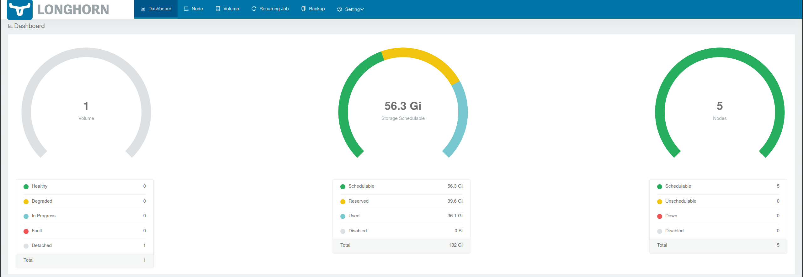

I'm in the middle of learning Kubernetes and solutions to manage a cluster, I'm practicing on a test cluster that has small containers on it like the one running *thebidouilleur.xyz*.    
    
Longhorn is a must-have in the Kubernetes universe *(and in particular **k3s**)*, I couldn't continue learning without dwelling on Longhorn.    
But first things first.    

## What is Longhorn?     
Longhorn is presented in this simple sentence:    
> Longhorn is a lightweight, reliable and easy-to-use distributed block storage system for Kubernetes.    
    
But we can go a little further than this simple sentence...    
Longhorn is a centralized storage system between cluster nodes. This means that instead of using an external storage like an NFS *([or other, here is the list of possibilities](https://kubernetes.io/docs/concepts/storage/storage-classes/)* we will be able to keep the data internally by using the disks of our machines present in the cluster. 
    
And if you ask yourself the same question as me before knowing : Longhorn will make the equivalent of a RAID 0 by replicating the data on several nodes to avoid that the loss of a machine leads to the loss of data.    
    
### Concrete values    
For example, counting the disks of my nodes I have 4x32Gio and 1x16Gio, that is 144Gio *( or 132Go because Rancher uses this value )*.    
Of these 132GB, I currently occupy 36, I can use 56 on Longhorn, and I have 40 reserved for replicas. *(by default, Rancher generates 3 replicas)*    
    
  

## Comment déployer Longhorn ?

## How to deploy Longhorn ?
    
[*link to official documentation*](https://longhorn.io/docs/1.3.0/deploy/install/)    
    
You can deploy Longhorn using Helm, the Rancher catalog or just through Kubectl    
    
  kubectl apply -f https://raw.githubusercontent.com/longhorn/longhorn/v1.3.0/deploy/longhorn.yaml    
    
:::note Version !    
Be careful, this command will only deploy version **1.3.0** of longhorn, remember to get the last link in the documentation *(or edit the link I put)*    
    
As a security measure, you should always check the contents in the applied yaml. Remember to take a look!    
:::    
    
You'll have to wait until the pods deploy to start using Longhorn.    
To check the real time status, the documentation suggests the following command:    
``bash    
kubectl get pods \
--namespace longhorn-system \
--watch
```

But you can use **[k9s](https://k9scli.io/)** as well.

Once OK, we can deploy our first pod linked to longhorn. 

## Putting Longhorn into practice

Here is the manifest that we will deploy to use a volume in longhorn:
```yaml
apiVersion: v1
kind: PersistentVolumeClaim
metadata:
  name: longhorn-nginx-thebidouilleur-demo
spec:
  accessModes:
    - ReadWriteOnce
  storageClassName: longhorn
  resources:
    requests:
      storage: 1Gi
---
apiVersion: v1
kind: Pod
metadata:
  name: longhorn-thebidouilleur-demo
  namespace: default
spec:
  containers:
    - name: block-volume-test
      image: nginx:stable-alpine
      imagePullPolicy: IfNotPresent
      volumeMounts:
        - name: volume-longhorn
          mountPath: "/usr/share/nginx/html"
      ports:
        - containerPort: 80
  volumes:
    - name: volume-longhorn
      persistentVolumeClaim:
        claimName: longhorn-nginx-thebidouilleur-demo 
```


We ask for 1Gio to be allocated to this volume *(it will influence the storage allocated for replicas)* and we deploy a classic nginx.
Once deployed, we will open a tunnel to this pod:
```bash
kubectl port-forward longhorn-thebidouilleur-demo 8080:80
```
:::tip
 Knowing that the tunnel must open on your **local** machine *(and not on one of the cluster nodes)*.                     
 I invite you to consult [this page](https://google.com) put kubectl on your machine.
:::
and if we query the nginx, we obviously get a 403 error because the longhorn folder is empty. 
So we will create our *index.html* file directly from the pod. 
bash
kubectl exec longhorn-thebidouilleur-demo -i -t -- /bin/sh
echo "Hello World" > /usr/share/nginx/html/index.html
```

And by re-interrogating our pod: we find our *Hello World*.
```bash
[thebidouilleur@bertha ~]$ curl localhost:8080
Hello World
```

Now... it's very nice but do we keep our page in case of deletion of the pod? 
``bash
kubectl delete pod longhorn-thebidouilleur-demo
```
We can see that on the longhorn dashboard: the volume has been switched to deattach. *(which means that the data are still present but not used on a pod)

We will re-apply the same manifest to recreate our pod and redo the same tunnel to access the nginx

bash
[thebidouilleur@bertha ~]$ curl localhost:8080
Hello World
```

We have our "Hello World" page back! 

## Conclusion
Longhorn is an extremely easy to use tool that allows you to avoid creating an external solution to the cluster that would be less practical to manage. I didn't go very far in its features either and I let you make your own opinion for *longhorn in production* (and for that, go see the article of the site [*easyadmin.tech*](https://easyadmin.tech/longhorn-solution-volumes-kubernetes-production)) 
Longhorn is welcome in my test Homelab and will be in the center of it ! 
