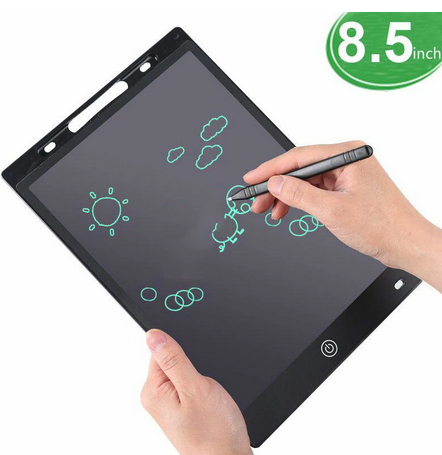

I recently went through an ~8 month formation during which I only had a keyboard to take notes. For me: no problem, I only ask for that: a support that I use personally and professionally. 
I type rather fast *(about ~100 words/minutes)*, I use macros, and shortcuts to simplify my life, and if I ever need a diagram: I use [draw.io](https://draw.io).

But during team work, I understood the importance *(and power)* of a pencil and a sheet of paper.
Without a representation method like schematics: you get lost quickly.

---

So I bought [*The Tablet*](https://fr.aliexpress.com/item/1005002840252915.html). A toy for children that works like any magic board we had as children. 

And this 5€ toy saved my life several times during multiplayer projects. It was enough to avoid buying paper during those 8 months. 

I still keep this tablet on my desk, but I would love a similar system, but keeping my writings/drawings in memory. 

That's how I acquired the...

## The  Remarkable

Having a colleague with this same jewel, I was able to find out in advance *(and even test)* this *reader*. It's a Linux-based tablet that allows you to read PDFs, and take notes via a stylus, imitating as much as possible the feel of paper. 

It takes a bit of practice to get the hang of it, but after a few hours, you can see how powerful the toy is in your hands.

You can upload pdf's from your computer to the tablet via USB or directly by dropping the files on the Remarkable cloud. 

:::info other methods 
I think it is also possible to drop your files by WiFi directly... never tested
:::

But if you use a remarkable tablet, don't forget that it will constantly sync with the brand's AWS servers by embedding your PDFs.

It's really annoying ... If only we had a solution! 

### Remarkable Fake Cloud

In its operation, remarkable is a **Linux** with a systemd daemon (named xochtl) that will manage the e-ink screen. And once the root password is obtained in the settings *(after reading that remarkable loves open-source, it's nice that they let the full power on the tablet)* you can have fun doing a lot of things...

The tablet can therefore acquire new features and also host some small applications *(within reason)*. 
And what interested me in this is the possibility to have its own remarkable cloud so that its files stay at home!

If some are interested, here is the [GitHub link with the link to the documentation](https://github.com/ddvk/rmfakecloud).

The UI allows me to upload PDFs which are synchronized as long as the tablet is on WiFi. And I can even send files from my own smtp (something impossible natively).

:::info To find it, you have to search
A little parenthesis about the author (DDVK) of the project. 
He regularly publishes programs to make his tablet more powerful, more ergonomic but he is very little active on the forums / reddit, I invite you to leave him a star to be informed of his new projects.
:::

So I can brag about my user being *admin* on the tablet.. :) 

## Conclusion

We started to approach note taking in a different way when the iPads came out, offering a cross between a PC and a smartphone experience. Remarkable has created an incredible product by offering a complete rethink of this functionality: no keyboard, no mouse... just a pen and a *"paper "* screen. 
And since the tablet is under Linux, I'm sure we're not done exploiting its potential by tinkering with it. (I didn't specify, but we have root access on the RM2) 

:::security deposit
(Edit on 24/10) 
Be careful not to store anything confidential, the tablet is not encrypted! Although the accesses are not obvious (You would have to dismount and dump the eMMC card), it is possible to find your files quite easily. 
If you are interested in this subject, here is an article that talks about it and even proposes a solution: https://blog.redteam-pentesting.de/2021/remarkable-encryption/
:::

:::note
*(Be careful, I didn't talk about the price... hang on if you want to buy it)*
:::
